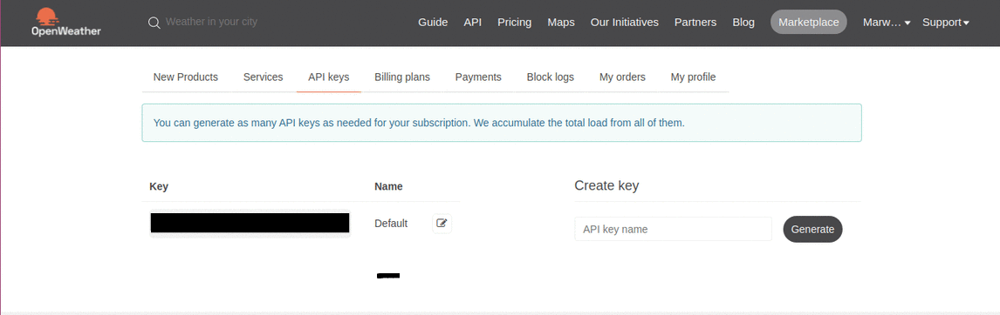

   
  <h1>Weather app 👨‍💻</h1>

## 📙 Summary

> Hey! This project helps to get the forecast in anywhere you want, it has been built using [Nodejs](https://nodejs.org/en/download/).
>
> In this project I used more than one [npm](https://www.npmjs.com/) libraries like [path](https://www.npmjs.com/package/path), [hbs](https://www.npmjs.com/package/hbs), [request](https://www.npmjs.com/package/request) and [express](https://expressjs.com/), as well as using [Open weathr map](https://openweathermap.org/) API to get the forecast of any location.

## 🏁 Start the Project

>  If you have a Nodejs, that's a good start. If not, here is the link to install it:
>
>  - [Nodejs](https://nodejs.org/en/download/). 

## :dart: ​Clone the project

> `$ git clone https://github.com/MarwanGalal746/Weather-app`

## 💻 Running

> At first, you need to register on [Open weathr map](https://openweathermap.org/) , then go to the [home page](https://home.openweathermap.org/) and choose API keys as shown in the following picture:
>
> 
>
> Then you will copy the API key as shown in the following picture: 
>
> 
>
> Then you will edit line 4 in [getWeathr.js](./web-server/src/getWeather.js) as shown in the next line:
>
> ` const API_KEY='a656sdf6545zxcv6df8685'     //This is a fake key, you will assign your own key which you copied it from the site  `
>
> Then you will go to terminal and change directory to the directory of the repository and type the following commands:
>
> `$ cd ./web-server `
>
> `$ npm install`
>
> `$ nodemon app.js`
>
> Then go to browser and and visit this [link](http://localhost:3000) and enjoy. 

## 